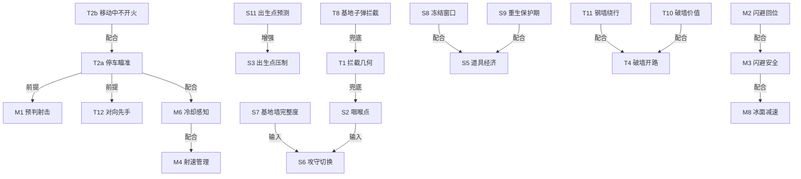

# God AI 调校计划 — 战术技巧库 × 经典关卡仿真 × 循序渐进打磨

> 目标：把 `src/ai/GodAIInput.ts` 从「30 秒丢基地的假完美玩家」打磨成真正的
> 「理论上限玩家」，解锁 `plan/Automated-Level-Design-and-Simulation.md` §3.3
> 卡死的 AI 联合调校（ai-baseline.json → evaluation-baseline.json →
> generated-stages.json 全部下游产物）。
>
> 方法论：**技巧库驱动 + 经典关卡仿真验证 + 战斗目标阶梯 + 固定节奏的调校循环**。
> 遵循 AGENTS §2（One Author / 确定性 / 数据大于代码）与 MANIFEST 三道关卡。

---

## 0. 现状基线（2026-07-27 实测）

| 指标 | 实测值 | 说明 |
|------|--------|------|
| classic 第 1 关过关率 | **0/3**（seeds 1–3） | 全部 gameover，基地被毁于 21–54s |
| hard 第 1 关过关率 | **0/3** | 同上，25–65s 丢基地 |
| 场均击杀 | 0–3 / 20 | 几乎不产生有效输出 |
| `generated-stages.json` | 空 `[]` | evaluator 的 `pass` 要求 stageClear，God AI 永远不赢 → 生成库颗粒无收 |

复现命令：`bun tools/level-sim.ts --stage 0 --difficulty classic --seed 1`
（结果 JSON 位于 `.result`，含 outcome / finalState / eventCounts）。

**根因诊断**（读码 + 仿真事件流）：

1. **不会停车瞄准**：`think()` 永远同时输出移动 + 开火。Battle City 中移动方向 = 炮口方向，边走位边"朝目标开火"实际是朝行进方向乱射（1799 tick 仅 87 发命中性子弹）。
2. **没有防守站位**：`selectTarget()` 只会「追击离基地最近的敌人」——全图追尾，永远迟到。不存在拦截几何、不守咽喉点、不回防。
3. **会拆自家墙**：proactive fire 不检查射线上是否有己方基地砖墙。
4. **不吃道具**：目标选择完全无视 `world.powerup`（星星/铲子/炸弹全部浪费）。
5. **闪避不验安全**：`dodgeDirection` 取第一个可走方向，可能撞向另一颗子弹。

---

## 1. 战略战术技巧库（Technique Catalog）

这是本计划的「弹药库」：每轮调校循环从中选取 **一项** 实现/强化，逐项验证收益。
按层级组织；【缺】= God AI 当前完全没有，【弱】= 有雏形但不达标，【有】= 已可用。

### 1.1 战略层（Strategic — 决定去哪、护什么）

| # | 技巧 | 状态 | 实现要点（落在 GodAIInput） |
|---|------|------|------------------------------|
| S1 | **基地防御优先**：基地存活 > 击杀数；保持在「敌人→基地」路径上 | 【缺】 | 目标函数改为拦截点而非敌人当前格（见 T1） |
| S2 | **咽喉点控制**：识别通向基地区 (24-25, 12-13) 的 2–3 条主通道，卡口驻防 | 【缺】 | 算法：`floodFill` 从基地向外 BFS 找宽度 ≤2 格的通道口，每 30 tick 重算（地形会变）；敌近则占位 |
| S3 | **出生点压制**：敌人固定 3 出生点（上左/上中/上右），刷兵前预瞄 | 【缺】 | `world.enemiesRemaining>0 && 存活敌少` 时移动到出生点射线上 |
| S4 | **波次节奏管理**：`MAX_ENEMIES_ALIVE=4`，控制击杀节奏避免同刷危险组合 | 【缺】 | 低优先级；场上=1 且队列有 power/armor 时保持防守阵位再补刀 |
| S5 | **道具经济**：拾取星星/铲子/炸弹；闪红坦克优先击杀 | 【缺】 | `world.powerup` 存在且距离/风险可接受时插入拾取目标 |
| S6 | **攻守切换**：按敌方余量/类型/基地墙完整度动态选 激进清场 vs 龟缩守家 | 【缺】 | 简单战力比阈值即可，不做复杂评估 |
| S7 | **基地墙完整度感知**：实时扫描基地护墙剩余量，墙越薄越紧急回防 | 【缺】 | `TileMap.baseCells`（4格）BFS 数砖墙层数/完整度 → `selectTarget` 权重；墙破到 1 层时回防优先级超一切（除直接拦截射向基地的子弹，见 T8） |
| S8 | **冻结窗口利用**：`world.freezeTimer>0` 敌人不动，是免费清场/吃道具/重整窗口 | 【缺】 | `think()` 开头查 `w.freezeTimer`：冻结期关防守逻辑，全速追杀最近敌或冲道具——当前完全浪费的 ~20s 免费优势 |
| S9 | **重生保护期利用**：`player.shieldTimer>0` 时无敌，应激进冲锋而非保守走位 | 【缺】 | 查 `p.shieldTimer`：有盾跳过闪避、直接贴脸最近敌——当前有盾也躲弹，浪费无敌窗口 |
| S10 | **关卡末尾收尾模式**：`enemiesRemaining≤2` 且场上敌≤1 时从防守切主动猎杀 | 【缺】 | `selectTarget` 末尾分支：剩余少不再守咽喉，A* 直扑最后 1–2 敌缩短通关时间（服务 O4） |
| S11 | **出生点轮换预测**：读 `spawnPointIndex` 预知下一只敌人从哪个出生点出现 | 【缺】 | 读 `w.spawnPointIndex`+`w.enemiesRemaining`：预判下出生点，提前移动设伏（比 S3 更精确） |

### 1.2 战术层（Tactical — 决定怎么打这一仗）

| # | 技巧 | 状态 | 实现要点 |
|---|------|------|----------|
| T1 | **拦截几何**：移动到敌人与基地连线的正交射线位，而非追尾 | 【缺】 | 目标格 = 敌人当前列/行与基地半径的交点，A* 导航过去 |
| T2a | **停车瞄准（同列/同行）**：敌人进入同列/同行时 `_moveDir=null` + 转向 + 开火 | 【缺】 | `enemyDir` 命中时 `_moveDir=null` 且朝 enemyDir 转向开火（当前最大败因，O2 头号技巧） |
| T2b | **移动中不开火**：移动方向 ≠ 瞄准方向时不开火（避免朝行进方向乱射） | 【缺】 | `think()` 中 `_fire = (moveDir===null \|\| moveDir===aimDir)`；与 T2a 同一问题两面，O2 同期实现 |
| T3 | **优先级目标选择**：威胁基地者 > power > armor(提前投入4发) > fast > basic；濒死敌补刀 | 【弱】 | 现只有"离基地最近"单一维度；加 kind 权重 + hp 权重 |
| T4 | **破墙开路**：朝目标方向定向拆砖制造射击线/捷径 | 【弱】 | 已会朝墙开火，但无"值不值得拆"判断；沿 A* 路径拆即可 |
| T5 | **子弹拦截**：对向子弹互消，保护自己与基地 | 【弱】 | 已有 intercept 分支；扩展到「拦截飞向基地的子弹」 |
| T6 | **不拆自家墙**：射线经过基地护墙(E 区周边砖)时禁止 proactive fire | 【缺】 | `scanAhead` 返回 wall 时区分是否基地保护砖 |
| T7 | **风筝拉扯**：对 fast 坦克后撤引入预瞄射线 | 【缺】 | 低优先级，靠 T2+T3 大概率够用 |
| T8 | **基地子弹拦截（终极防线）**：敌方子弹朝基地飞行时移到轨迹上用身体/子弹拦截 | 【缺】 | 扫所有敌弹：若 `bullet.dir` 朝向基地且弹道延长线过基地，插入「拦截点=弹道与基地连线交点」——比 T5 更高优先级 |
| T9 | **同列/同行优先射击排序**：多敌同列选 HP 最高/最危险的打，而非最近 | 【缺】 | `findEnemyDirection` 按 `kind` 权重（power>armor>fast>basic）+`hp` 排序，先杀威胁最大 |
| T10 | **破墙价值评估**：拆前判断「开的路值不值得」——通咽喉的墙值拆，死胡同不拆 | 【缺】 | `shouldFireInFacingDir` 中 `wall=true` 时查 A* 路径是否经此墙：是则拆，否则省子弹 |
| T11 | **钢墙绕行意识**：钢墙不可毁（除非 3★），遇钢墙立即绕行而非持续开火 | 【缺】 | `scanAhead` 区分 steel/brick；`shouldFireInFacingDir` 遇 steel 且 `player.level<3` 返回 false + 触发 replan |
| T12 | **对向遭遇战先手**：与敌面对面相向而行时，停车瞄准+先开火=必赢（玩家射速≥敌人） | 【弱】 | T2a 延伸：敌在正前方且也在朝我移动时确保 `_moveDir=null`+立即开火 |
| T13 | **林间隐蔽利用**：森林挡视线，敌穿森林时短暂消失，预判出口提前瞄准 | 【未来储备】 | 当前 God AI 全局视野下无收益，待加感知限制才有意义（循环里跳过） |

### 1.3 微操层（Micro — 每个 tick 的正确性）

| # | 技巧 | 状态 | 实现要点 |
|---|------|------|----------|
| M1 | **预判射击（lead shot）**：对移动目标按其速度提前量开火 | 【缺】 | 用 `TANK_CONFIGS[kind].speed` 推算 N tick 后位置；**约束：仅停车时预判**（移动中预判=朝行进方向预判=仍乱射，必须 T2a 先停车） |
| M2 | **闪避后回位**：侧移躲弹后立即恢复原目标，不迷路 | 【弱】 | dodge 后 path 保留，但 dodge 本身不验证目标格安全 |
| M3 | **闪避安全验证**：候选闪避格需不在任何其他子弹预测轨迹上 | 【缺】 | 对每个 open dir 跑一次 `findMostDangerousBullet` 式检查 |
| M4 | **射速管理**：冷却期间只走位不空转 fire 标志 | 【弱】 | 读 `player.cooldown`，冷却中把 fire 留给关键目标 |
| M5 | **格子对齐**：转向前 snap 到格子，避免卡墙抖动 | 【有】 | `snap()` 已用，回归测试守住即可 |
| M6 | **冷却感知射击**：读 `nextFireInterval`+`lastFire`，冷却中 `_fire=false` | 【缺】 | `think()` 中 `now - p.lastFire < p.nextFireInterval` 则 `_fire=false`，省 RNG 抽取 + 避免冷却末错过窗口 |
| M7 | **格子对齐后转向**：转向前确保已 snap 到格子，避免斜撞墙卡死 | 【有】 | `followPath` 返回方向前加「未对齐则先微调到格子」预对齐 |
| M8 | **冰面减速意识**：`world.isTankOnIce(p)` 时避免急转弯（会滑），选直线最短路径 | 【缺】 | `dodgeDirection` 冰面候选方向优先考虑与 `vx/vy` 同向，防滑入弹道 |
| M9 | **子弹速度差利用**：玩家弹速比 basic 快 5%，对 fast 需更大提前量、对 armor 更小 | 【缺】 | M1 参数化：提前量=`enemySpeed*(dist/playerBulletSpeed)`，enemySpeed 取 `BASE_SPEED_CPS[kind]` |
| M10 | **多目标同列连射**：同列 2+ 敌时首杀后不转向，继续同方向连射 | 【缺】 | `findEnemyDirection` 返回后查该方向射线是否多敌：是则保方向+持续开火，不因击杀重选目标 |

> **实现纪律**：所有新随机性走 `world.rng`（AGENTS §2.3）；所有阈值进
> `GodAIParams`（数据大于代码）；`SKILLED_HUMAN_PARAMS` 必须继续由 God 参数
> 派生（双倍延迟 + 高瞄准误差），God 变强则人类代理自动变强。

### 1.4 道具经济深化（S5 扩展）

原 S5 只说「拾取道具」，但道具系统有 8 种类型，优先级差异巨大，需拆分：

| 子技巧 | 要点 |
|--------|------|
| **S5a 道具优先级排序** | `bomb`（全屏清场）> `star`（永久强化）> `freeze`（20s 免费窗口，配合 S8）> `fence`（钢墙护基，配合 S7）> `tank`（加命）> `shield`/`helmet`（临时无敌，配合 S9）> `boat`（渡水，情境性） |
| **S5b 道具风险评估** | 拾取前评估路径上是否有敌拦截——为 `star` 穿过火力线可能送命不值；但 `bomb` 值得冒险（捡到就全杀） |
| **S5c 闪红坦克优先击杀** | `tank.bonus===true` 的敌击杀后掉道具——`selectTarget` 给 bonus 敌额外权重（比 S3 更直接道具来源） |
| **S5d 道具即将消失抢收** | `pu.lifeTimer` 接近 `POWERUP_TIMEOUT_MS`（20s）时若距离可接受则优先捡，否则永久浪费 |

### 1.5 技巧依赖关系图（决定调校先后）



> **排程提示**：每轮仍只选 **一项** 技巧，但优先选「其前提已就绪」的——T2a 必须先于
> M1/T12；S7/S2 是 S6 的输入；T8 是 T1 的兜底（T1 失败仍能救场）；S8/S9 放大 S5 收益。
> 依赖图的「前提/输入」边即调校先后顺序的硬约束。「未来储备」技巧（T13）在加入感知限制前跳过。

---

## 2. 经典关卡仿真基础设施（已有，直接复用）

| 工具 | 用途 | 调校中的角色 |
|------|------|--------------|
| `tools/level-sim.ts` | 单关单种子无头仿真 | 单点复现失败盘 |
| `tools/batch-sim.ts` | 批量 seeds × stages | 每轮回归 |
| `tools/ai-calibrate.ts` | God + Skilled Human 双代理跑门禁 | 阶段验收 |
| `tools/report.ts` | 聚合统计 | 轮次报告 |
| `tests/calibration.test.ts` | 21 个基建测试 | 已绿，别弄坏 |

**需新增的一项基建（Phase 0）——失败归因（Failure Taxonomy）**：
当前 SimResult 只有 outcome，无法回答「为什么输」。在 `tools/simulation-runner.ts`
的事件流收集处附加终局归因：

```ts
failure?: {
  cause: 'base_destroyed' | 'lives_exhausted' | 'timeout'
  tick: number
  killerKind?: TankKind        // 谁毁的基地 / 谁打死的最后一命
  playerDistToBase?: number    // 死亡瞬间玩家离基地多远（追尾迟到的证据）
  firstKillTick?: number       // 首杀时间（输出效率）
}
```

纯 tools 层修改，不触碰 src/ 模拟层。每轮调校的「败因 Top-3」全靠它。

**仿真预算与抽样阶梯**（单盘 ~0.1–1.2s wall，全量很贵，按需升档）：

| 档位 | 规模 | 用途 | 预估耗时 |
|------|------|------|----------|
| S0 冒烟 | 第 1 关 × 10 seeds × 1 难度 | 每次改动后的秒级反馈 | ~15s |
| S1 抽样 | 关 {0,4,9,14,19,24,29,34} × 5 seeds × 2 难度 | 轮内验证 | ~2min |
| S2 全量 | 35 关 × 20 seeds × 2 难度 | 阶段门禁验收 | ~20min |

---

## 3. 战斗目标阶梯（循序增强，每级是硬门禁）

不许跳级。上一级不稳定（连续 2 轮达标）之前不进入下一级的调校。

```
O1 活下来      → O2 守住基地     → O3 清场过关      → O4 打得漂亮
   (不团灭)        (基地存活率)      (过关率)           (效率指标)
                                        ↓
O6 人类代理达标  ← O5 高难度达标
   (Skilled Human)   (hard / chaos)
```

| 级 | 战斗目标 | 门禁（S2 全量口径） | 主攻技巧 |
|----|----------|--------------------|----------|
| **O1** | 玩家生存：不再送命 | classic 平均剩余命 ≥ 2.0 | M3 闪避安全、M2 回位 |
| **O2** | 基地存活 | classic 基地存活率 ≥ 90% | **T2a/T2b 停车瞄准+移动不开火、T1 拦截几何、S2 咽喉、T6 不拆家、T8 基地子弹拦截、S7 基地墙完整度**（本级是主战场；T8/S7 是 T1 失败后的终极/兜底防线，评审补充后并入 O2 主攻） |
| **O3** | 清场过关 | classic 过关率 ≥ 90%；第 1 关 10/10 | T3 优先级、S3 出生点压制、T4 破墙 |
| **O4** | 效率 | classic 通关 P90 ≤ 180s；KPM 进入 8–14 区间 | M1 预判、M4 射速、S5 道具 |
| **O5** | 高难度 | **hard ≥ 70%、chaos ≥ 30%**（上游计划 §3.3A 原门禁） | S6 攻守切换、S4 波次、T5 拦弹 |
| **O6** | 人类代理 | Skilled Human：hard ≥ 50%、chaos ≥ 15%（§3.3C） | 只调 params，不加代码 |

> O6 失败的含义：God AI 的强度来自「作弊级微操」而非「正确决策」——
> 双倍延迟一加就崩，说明该回去补战术层而不是继续磨微操层。

---

## 4. 调校循环协议（每轮固定节奏）

```
┌────────────────────────────────────────────────────────┐
│ Round N                                                │
│ 1. 跑当前档位仿真（S0/S1，按所处目标级）                  │
│ 2. 失败归因聚类 → 败因 Top-3（靠 Phase 0 的 taxonomy）    │
│ 3. 从 §1 技巧库选 ⼀项 针对头号败因 —— 一轮只改一件事      │
│ 4. 实现（阈值进 GodAIParams；随机走 world.rng）           │
│ 5. S0 冒烟 → 有效则 S1 验证 → 记录 docs/god-ai-tuning-log │
│ 6. bun run check 绿（359 tests 不许红）                   │
│ 7. 判定：                                                │
│    · 当前级门禁达标（连续 2 轮）→ 晋级下一战斗目标          │
│    · 连续 3 轮 Δ过关率 < 2% → 触发「极限判定」(§5)         │
└────────────────────────────────────────────────────────┘
```

**调校日志**（`docs/god-ai-tuning-log.md`，每轮一行表格 + 简注）：

```
| Round | 目标级 | 改动(技巧#) | S1 过关率 | 基地存活率 | 败因Top1 | 判定 |
```

**回归防倒退（新增 gate 测试）**：`tests/god-ai-gates.test.ts`
- 「God AI classic 第 1 关 × 3 seeds ≥ 2 次过关」——曾经的致命盲区（0/10 却全绿）
  永不复发；规模刻意小（<5s，吸取 calibration.test 的 5s-cliff 教训），全量归 CLI。
- 确定性回归：同 seed 两跑逐 tick 一致。

---

## 5. 极限判定与敌人 AI 兜底（循环的出口）

God AI 不是无限打磨的——上游计划 §3.3A 已有明确出口：

1. **极限判定**：连续 3 轮 Δ<2% 且 §1 技巧库中 S/T 层已全部【有】→ 认定 God AI 达到极限。
2. **兜底调校敌人 AI**（只动配置，不动引擎，符合 AI 宪法 §6）：
   - 降 `INTELLIGENCE_LEVELS` 各档能力（dodge/prediction/reaction）；
   - 调 `DIFFICULTY_TIER_DISTRIBUTION`（hard/chaos 的 veteran+commander 占比）；
   - 降 `COMMANDER_FLOOR`。
3. 兜底后必须重跑 O5 + O6 双门禁（防止「敌人调弱→对真人偏难」陷阱，§3.3C）。

---

## 6. 收尾：固化基准，解锁下游

O1–O6 全部达标后，按上游计划顺序执行（顺序不可换）：

1. `bun run ai-calibrate --seeds 100 --difficulty all` → **落盘 `ai-baseline.json`**
   （God 参数 + Skilled Human 参数 + 各难度过关率 + 门禁判定）。
2. `bun run calibrate` → **落盘 `evaluation-baseline.json`**（35 关反向拟合）。
3. `bun run gen-library` 重跑 → `generated-stages.json` 从空 `[]` 变为 ≥50 关；
   `bun run play-generated` 人工抽玩验证。
4. DECISIONS.md 记录：God AI 最终技巧集 + 参数 + 各级门禁实测值。

---

## 7. 验收标准（Definition of Done）

- [ ] Phase 0：SimResult 含 failure taxonomy；`tests/god-ai-gates.test.ts` 存在且绿
- [ ] O2：classic 基地存活率 ≥ 90%（S2 全量）
- [ ] O3：classic 过关率 ≥ 90%，第 1 关 10/10
- [ ] O5：hard ≥ 70%，chaos ≥ 30%
- [ ] O6：Skilled Human hard ≥ 50%，chaos ≥ 15%
- [ ] `ai-baseline.json` / `evaluation-baseline.json` 落盘；`generated-stages.json` ≥ 50 关
- [ ] `docs/god-ai-tuning-log.md` 完整记录每轮（改动/数据/判定可追溯）
- [ ] 全程 `bun run check` 绿；无 `Math.random()` 进入决策路径；God AI 代码不进可玩构建

## 8. 三道关卡自检（MANIFEST §13）

| 关卡 | 论证 |
|------|------|
| 更享受 | God AI 达标 → 关卡筛选器活了 → 玩家获得经过质检的无限新关卡 |
| 架构简洁 | 全部改动集中在 `GodAIInput.ts` + tools 层；模拟层零改动；One Author 无损 |
| 尊重原版 | 技巧库全部来自人类玩原版的真实打法（守家/卡口/停车瞄准），不是超人类外挂 |

---

*版本 1.1 · 2026-07-27（据 plan/godai.review.md 升级：补 S7–S11 / T8–T13 / M6–M10；T2 拆 T2a+T2b；S5 拆 S5a–S5d；新增 §1.5 依赖图；O2 并入 T8/S7）*
*版本 1.0 · 2026-07-27 · 前置：plan/Automated-Level-Design-and-Simulation.md §3.3*
*基线实测：classic/hard 第 1 关 0/6 过关，根因见 §0*
